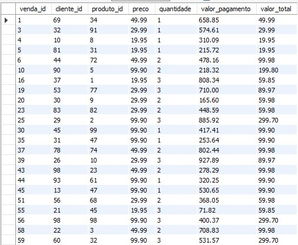

# Projeto: Geração e Análise de Dados de Vendas com Python e SQL

## Descrição do Projeto

Este projeto consiste em gerar dados fictícios e desorganizados para um sistema de vendas, estruturá-los em um banco de dados MySQL e realizar consultas SQL para análise. O objetivo principal é simular um ambiente de dados realista para praticar habilidades de análise de dados e manipulação de banco de dados.

## Estrutura do Projeto

1. **Geração de Dados Fictícios**: Utilizando Python e bibliotecas como `random` e `pandas`, são gerados dados aleatórios para quatro tabelas principais:
    - `clientes`: Contém informações sobre os clientes.
    - `produtos`: Contém informações sobre os produtos.
    - `vendas`: Registra as vendas realizadas, relacionando clientes e produtos.
    - `pagamentos`: Registra os pagamentos realizados para cada venda.

2. **Criação de Tabelas e Inserção de Dados**: Um script SQL é gerado para criar as tabelas acima mencionadas no banco de dados MySQL e inserir os dados fictícios gerados.

3. **Consultas SQL para Análise**: Várias consultas SQL são executadas para analisar os dados. Um exemplo de consulta é listar as vendas onde o valor pago é maior que o preço do produto vezes a quantidade vendida.

## Exemplo de Consulta SQL

```sql
SELECT 
    v.venda_id,
    v.cliente_id,
    v.produto_id,
    p.preco,
    v.quantidade,
    pg.valor_pagamento,
    (p.preco * v.quantidade) AS valor_total
FROM 
    vendas v
JOIN 
    produtos p ON v.produto_id = p.produto_id
JOIN 
    pagamentos pg ON v.venda_id = pg.venda_id
WHERE 
    pg.valor_pagamento > (p.preco * v.quantidade);


  
